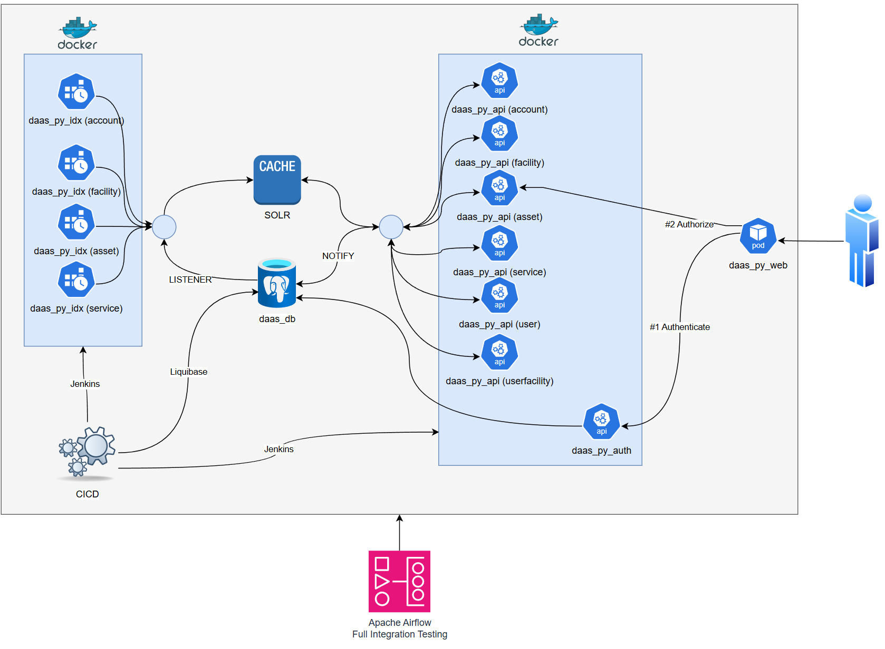

# daas_docs

## Description

Single repository  to aggregate all documentation of projects related to DaaS (Data as a Service).  This overall projects is to demonstrate a small platform to centralize data, and have it availiable through an api layer.  It will consist of several source databases, and a SOLR instance for caching.

## Table of Contents

- [Technology Stack](#technology-stack)
- [High level project structure](#high-level-project-structure)
- [Project Links](#project-links)
- [Architecture](#architecture)
- [Contact](#contact)

## Technology Stack
### Database:  
__PostgreSQL__  
_Liquibase for src migrations_  

Central database of the system.  This layer will handle read/writes of objects.  When records are updated in the database, they will trigger a NOTIFY event; which is being listened by the index layer.

### Cache:  
SOLR

### Python/Django
__Authentication & Authorization Layer:__  
___daas_py_auth___  
Service using JWT to first authenticate a consuming user, then build a toke with the list of allowable facilities for that user.  This token is then required to #1) hit the API layer, and #2) fetch and update data from both the DB and SOLR.

__API Layer:__  
___daas_py_api___   
Django API service that is generic and can be used for any domain in the DaaS.  It is fully configuration driven  This setup is a custom more granular project with a managed DBMS layer. 

__Index Layer:__  
___daas_py_idx___  

This layer will listen to PostgreSQL NOTIFY events, and pull them off.  They will then be processed in batches of either quantity X or time Y.  This way we can control batching.  For example, process every 100 records or every 10 seconds.  Whichever comes first.

[example](https://github.com/nealrout/daas_py_idx/blob/develop/daas_py_idx/main.py)

__Common components:__  
Logging: Python standarrd logger  
Configuration:  dynaconf  
Secrets: dynaconf/cryptography

## High level Python project structure

    daas_py                      (ROOT)
    ├───daas_py_auth             (AUTH API)
    ├───daas_py_api              (GENERIC API)
    │   ├───api         
    │   │   ├───domain         
    │   │   ├───api      
    ├───daas_py_idx              (GENERIC INDEXER)   
    ├───daas_py_common           (COMMON)
    │   ├───util                 
    ├───daas_py_config           (CONFIG)

## Project Links
### [daas_db](https://github.com/nealrout/daas_db) - PostgreSQL Liquibase

### [daas_py_auth](https://github.com/nealrout/daas_py_auth) - Django Authorize/Authenticate API

### [daas_py_api](https://github.com/nealrout/daas_py_api) - Django Generic API (Main)

### [daas_py_idx](https://github.com/nealrout/daas_py_idx) - Generic Index manager - (Main).

### [daas_py_common](https://github.com/nealrout/daas_py_common) - Common Utils

### [daas_py_config](https://github.com/nealrout/daas_py_config) - Configuration & Secret Management

### [daas_solr](https://github.com/nealrout/daas_solr) - SOLR instance setup

### [daas_build](https://github.com/nealrout/daas_build) - Docker and other build/deploy stuff

### [daas_airflow](https://github.com/nealrout/daas_airflow) - Apache Airflow for integration testing

## Architecture

## Contact
Neal Routson  
nroutson@gmail.com
